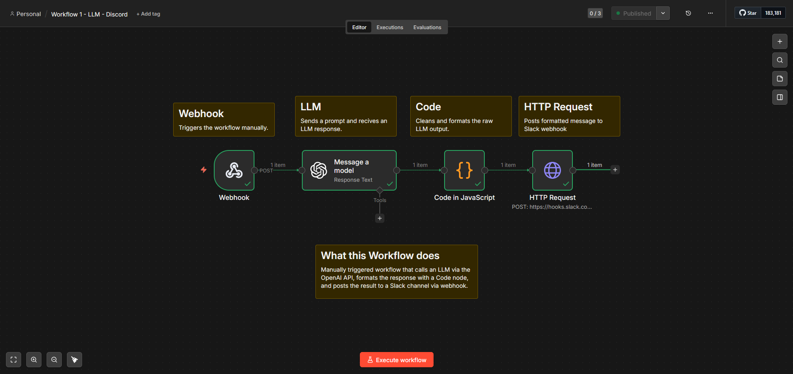
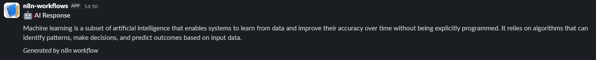

# Workflow 1 — LLM + Slack Notification

## What it does
Manually triggered workflow that calls an LLM via the OpenAI API, 
formats the response with a Code node, and posts the result to a 
Slack channel via webhook.

## Architecture
Manual Trigger → LLM → Code (format) → HTTP Request (Slack)

## Trigger
Manual

## Key nodes
| Node | Purpose |
|------|---------|
| OpenAI | Sends prompt, receives LLM response |
| Code | Cleans and formats the raw LLM output |
| HTTP Request | Posts formatted message to Slack webhook |

## Error handling
LLM node set to Continue on Error. Code node guards against 
empty responses.

## Screenshots

