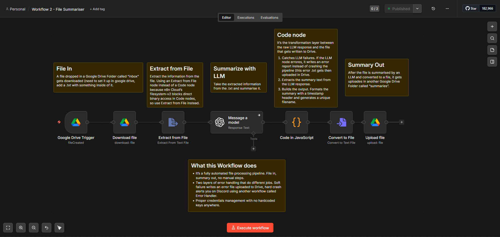
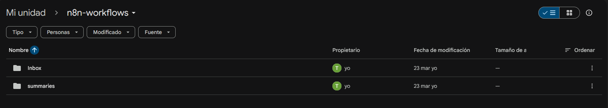

# Workflow 2 — Automated File Summariser

## What it does
Watches a Google Drive folder called n8n-inbox. When a .txt file 
is added, it extracts the text, sends it to an LLM for summarisation, 
and saves the summary as a new .txt file in n8n-summaries. Runs 
fully automatically with no manual steps.

## Architecture
Google Drive Trigger → Download File → Extract from File → 
LLM → Code (format) → Convert to File → Upload to Drive

## Trigger
Google Drive file created event — fires when a file is added 
to the n8n-inbox folder.

## Key nodes
| Node | Purpose |
|------|---------|
| Google Drive Trigger | Watches inbox folder for new files |
| Download File | Downloads the binary file content |
| Extract from File | Converts binary to readable text |
| OpenAI | Summarises the extracted text |
| Code | Formats summary and generates output filename |
| Convert to File | Converts text back to binary for upload |
| Upload to Drive | Saves summary file to n8n-summaries folder |

## Error handling
LLM node set to Continue on Error. Code node writes an error 
report file to Drive instead of crashing. Error Workflow assigned 
— sends Discord alert on hard crash.

## Screenshots

