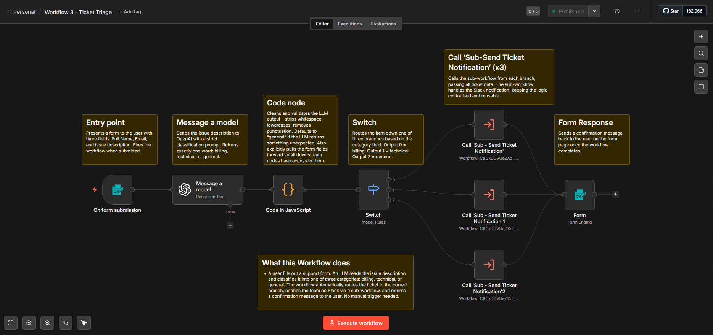
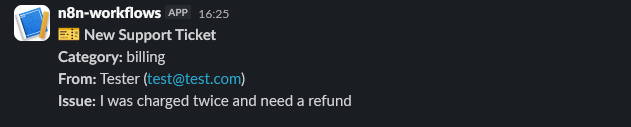
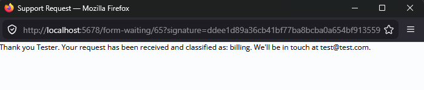

# Workflow 3 — Support Ticket Triage

## What it does
Presents a support form to users. When submitted, an LLM classifies 
the issue as billing, technical, or general. The workflow routes to 
the correct branch, notifies the team on Slack via a reusable 
sub-workflow, and returns a confirmation message to the user.

## Architecture
Form Trigger → LLM (classify) → Code (clean + enrich) → 
Switch (route) → Sub-workflow (notify) → Form Response

## Trigger
n8n Form Trigger — fires on form submission.

## Key nodes
| Node | Purpose |
|------|---------|
| On form submission | Presents form, captures name, email, issue |
| OpenAI | Classifies issue into billing, technical, or general |
| Code | Cleans LLM output, validates category, pulls form fields forward |
| Switch | Routes item to correct branch based on category |
| Call Sub-workflow (x3) | Calls Send Ticket Notification for each branch |
| Form Response | Returns confirmation message to the user |

## Error handling
LLM node set to Continue on Error. Code node defaults unknown 
categories to general. Error Workflow assigned.

## Sub-workflow
Uses Sub - Send Ticket Notification to post Slack messages. 
Centralised notification logic shared across all three branches.

## Screenshots

