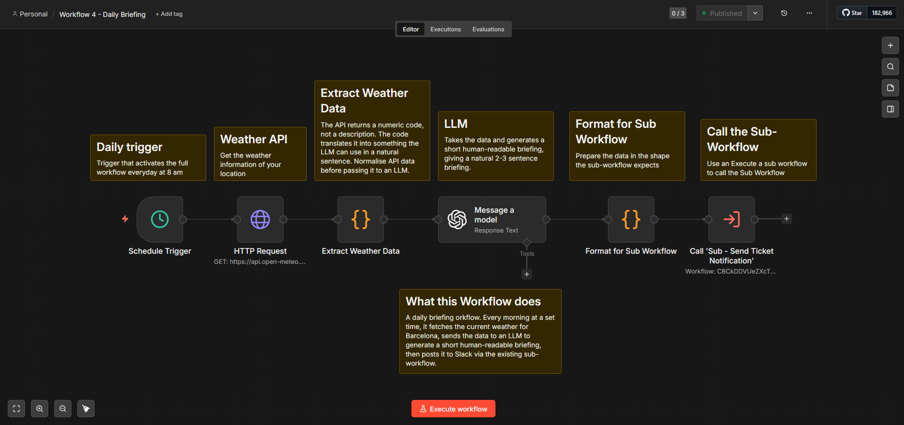
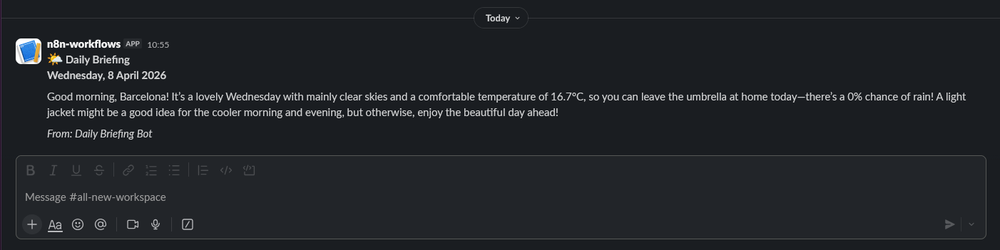

# Workflow 4 — Daily Briefing

## What it does
Runs every morning at 8am. Fetches live weather data for Barcelona 
from the Open-Meteo API, generates a human-readable briefing with 
an LLM, and posts it to Slack via the same sub-workflow used by 
Workflow 3.

## Architecture
Schedule Trigger → HTTP Request (weather API) → Code (extract) → 
LLM (generate briefing) → Code (format) → Sub-workflow (notify)

## Trigger
Schedule Trigger — fires daily at 8:00am.

## Key nodes
| Node | Purpose |
|------|---------|
| Schedule Trigger | Fires at 8am every day |
| HTTP Request | Fetches live weather from Open-Meteo API |
| Code (extract) | Translates weather codes to readable descriptions |
| OpenAI | Generates a natural language morning briefing |
| Code (format) | Maps data to sub-workflow field schema |
| Call Sub-workflow | Posts briefing to Slack |

## Error handling
Error Workflow assigned — sends alert on hard crash.

## Sub-workflow
Reuses Sub - Send Ticket Notification from Workflow 3. 
Demonstrates sub-workflow reuse across different parent workflows.

## Screenshots

