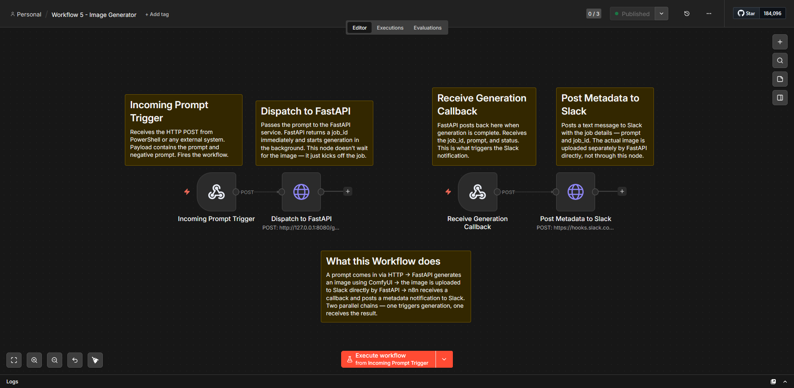
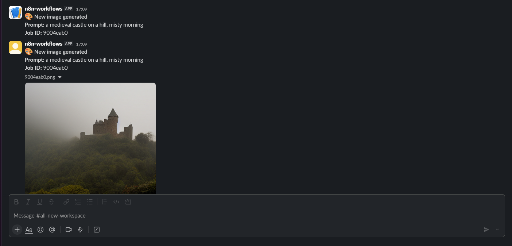
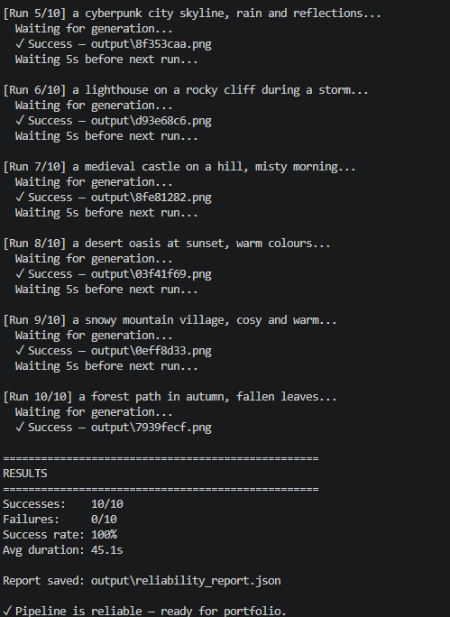

# Workflow 5 - Image Generator

## Overview

A compound automation pipeline that connects four separate systems —
n8n, FastAPI, ComfyUI, and Slack — into a single triggered workflow.
A user submits a prompt via HTTP, the system generates an image using
a local Stable Diffusion model, and delivers the result to Slack
without any manual intervention.

## The Problem It Solves

Manual image generation in ComfyUI requires opening a browser, 
typing a prompt, waiting, and downloading the result. For teams 
that need multiple variations or scheduled generation, this is 
slow and unscalable. This pipeline removes the human from every 
step after the initial trigger.

## Architecture

**Trigger**
An HTTP POST request with a prompt hits the n8n webhook, which 
forwards it to the FastAPI service.

**Generation**
FastAPI returns a job ID immediately and starts generation in the 
background. It loads the ComfyUI workflow, injects the prompt, 
submits it to the ComfyUI API, and polls until the image is ready. 
The image is then downloaded locally.

**Delivery**
FastAPI uploads the image directly to Slack using the Files API. 
It then posts a callback to n8n with the job metadata, and n8n 
forwards a notification message to Slack.

## Stack

| Component | Role                                                        |
|-----------|-------------------------------------------------------------|
| n8n       | Orchestration — webhook trigger and Slack notification      |
| FastAPI   | Python service — receives requests, manages pipeline        |
| ComfyUI   | Image generation — Stable Diffusion via REST API            |
| Slack     | Delivery — image upload and metadata message                |
| Pydantic  | Request validation — rejects malformed inputs automatically |

## Python files

| File | Purpose |
|------|---------|
| `api.py` | FastAPI service — main pipeline controller |
| `comfy_client.py` | Standalone ComfyUI API client |
| `pipeline.py` | Batch generation with prompt variations |
| `prompt_variations.py` | Style, seed, and subject variation strategies |
| `image_processor.py` | Post-processing, enhancement, metadata |
| `reliability_test.py` | 10-run consecutive test suite |
| `workflow_api.json` | ComfyUI workflow in API format |

## Error handling

Two layers:

**Service level (FastAPI):** Each stage of the pipeline has its own 
try/except — ComfyUI health check, workflow submission, generation 
timeout, image download. Any failure sends a typed error payload back 
to n8n via callback instead of crashing silently.

**Workflow level (n8n):** Error Workflow assigned — sends a Slack 
alert on hard crash. The pipeline never dies without notification.

## Key Technical Decisions

**Non-blocking generation:** FastAPI returns a job_id immediately
rather than waiting for generation to complete. This prevents HTTP
timeouts on long generations and allows the caller to continue
without blocking.

**Callback pattern:** Instead of polling for results, FastAPI
posts back to n8n when generation is complete. This is more
efficient and mirrors how production webhook systems work.

**ComfyUI as a service:** ComfyUI's REST API accepts workflow
JSON as a payload. The Python script injects prompt and seed
values dynamically — the UI is never touched after setup.

**Two-layer error handling:** Node-level errors (LLM failures,
file issues) are caught and handled gracefully. Hard crashes
trigger a separate error workflow that alerts via Slack.

## What I Learned

**Systems integration is mostly about data shapes.** The hardest
bugs were not in the generation logic — they were in understanding
exactly what shape of data each system expected. n8n's production
and test modes use different JSON structures. Slack deprecated
their file upload API in 2024. ComfyUI's workflow JSON uses node
IDs as keys, not names.

**Debug one segment at a time.** When the pipeline broke, the
instinct is to look everywhere. The correct approach is to isolate
each connection — test FastAPI independently, test ComfyUI
independently, test n8n independently — before connecting them.
This is the same principle as bypassing nodes in Houdini to find
where the network breaks.

**Non-blocking architecture matters immediately.** A synchronous
implementation would timeout on generations longer than 30 seconds.
Background tasks and callbacks are not advanced patterns — they
are the baseline for any real integration work.

## Results

- 10/10 consecutive runs without failure
- Average generation time: ~45 seconds per image
- Full pipeline: trigger to Slack delivery in under 60 seconds
- Zero manual steps after initial HTTP trigger

## Files

| File                   | Purpose                                    |
|------------------------|--------------------------------------------|
| `api.py`               | FastAPI service — main pipeline controller |
| `comfy_client.py`      | ComfyUI API client                         |
| `pipeline.py`          | Batch generation with prompt variations    |
| `prompt_variations.py` | Variation strategy engine                  |
| `image_processor.py`   | Post-processing and metadata               |
| `reliability_test.py`  | 10-run consecutive test suite              |
| `workflow_api.json`    | ComfyUI workflow in API format             |

## Setup

1. Install ComfyUI and a Stable Diffusion checkpoint
2. Install dependencies: `pip install -r requirements.txt`
3. Copy `.env.example` to `.env` and fill in your credentials
4. Start ComfyUI: `python main.py`
5. Start FastAPI: `python api.py`
6. Import n8n workflows from the `n8n-workflows` repo
7. Activate Workflow 5 in n8n
8. Test: POST to `http://localhost:5678/webhook/generate-image`

## Screenshots

